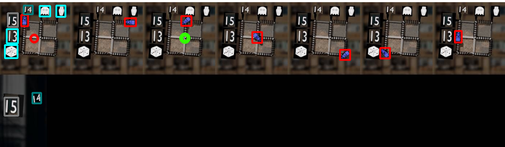

# CaptchaSolver
## Пример работы программного модуля

## Принцип работы
Для детекции иконок используется [**Yolov8**](https://github.com/ultralytics/ultralytics) (доступны модели S и M), для детекции поезда - **Yolov8** с разрешением 1280. \
Для мэтчинга иконок - [**CLIP**](https://github.com/openai/CLIP) (VIT-L-14). \
  
Для увеличения точности работы алгоритмы иконки из подсказок сравниются только с соответствующими *вертикальными* или *горизонтальными* иконками. Таким образом, происходит всего 6 сравнений для определения ответа. 
После того, как определено положение иконок из подсказок, находится узел, соответствующий точке пересечения. Фактически, ***точка пересечения*** - это максимум координат по каждой оси. Используя информацию о местоположении поездов, происходит поиск ближайшего к точке пересечения поезда (с учётом смещения координат).
Ответом является центр патча, которому принадлежит поезд с наименьшим расстоянием до точки пересечения иконок из подсказок. 

## Запуск решения
Для оценки точности решения создан скрипт "validation.py". 
Подготовлен Docker-файл с образом, воспроизводящим решение.

## Веса моделей
Для запуска программы необходимо скачать и поместить в папку weights файлы из https://disk.yandex.ru/d/wt_IsZT-gRUozQ.\
Итоговая структура папки weights:\
**weights:** 
* ViT-L-14.pt
* yolov8_train:
  * train.pt
* yolov8_objects:
  * objects.pt
  * objects_m.pt
